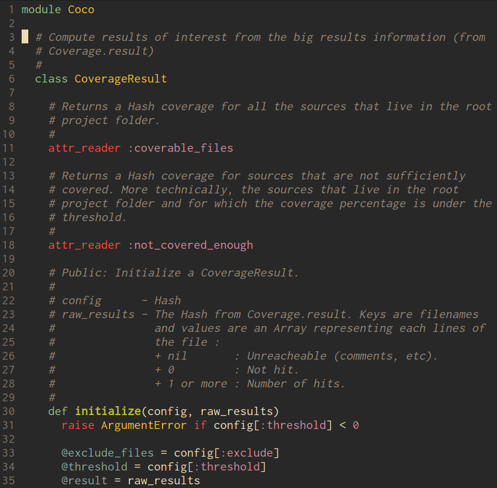
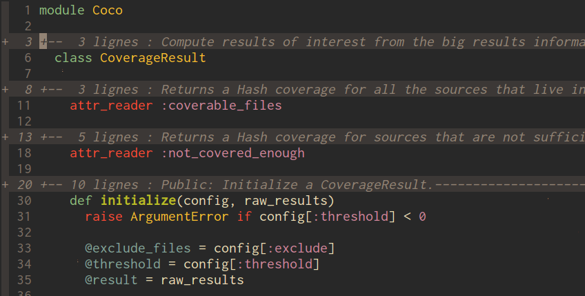

foldcomments.vim
================

Folds all commentaries of a source file.

Without:

With:

Installation
------------

With [pathogen.vim](https://github.com/tpope/vim-pathogen)

    cd ~/.vim/bundle
    git clone git://github.com/lkdjiin/vim-foldcomments.git

With [vundle](https://github.com/gmarik/Vundle.vim)

    Bundle 'git://github.com/lkdjiin/vim-foldcomments.git'

Usage
-----

    :FoldComments

Or, better, you could map the command `FoldComments` in your .vimrc, for example
on the F5 key:

    map<F5> :FoldComments<Enter>

To unfold, use `zE`, or map it like this:

    map<F6> zE

Caveats
-------

Not all file's type are supported. This is curently limited to unix comment
style (`#`), Ruby, Haskell, Java, C, Javascript, Logo, Racket, Scheme
and Vim.

Contributing
-------------------------

1. Fork it
2. Create your feature branch (`git checkout -b my-new-feature`)
3. Commit your changes (`git commit -am 'Add some feature'`)
4. Push to the branch (`git push origin my-new-feature`)
5. Create new Pull Request

License
--------------------------

Copyright 2013, 2014 Xavier Nayrac. Distributed under the same terms as
Vim itself. See `:help license`.

Questions and/or Comments
--------------------------

Feel free to email [Xavier Nayrac](mailto:xavier.nayrac@gmail.com)
with any questions, or follow me on [twitter](https://twitter.com/lkdjiin).
